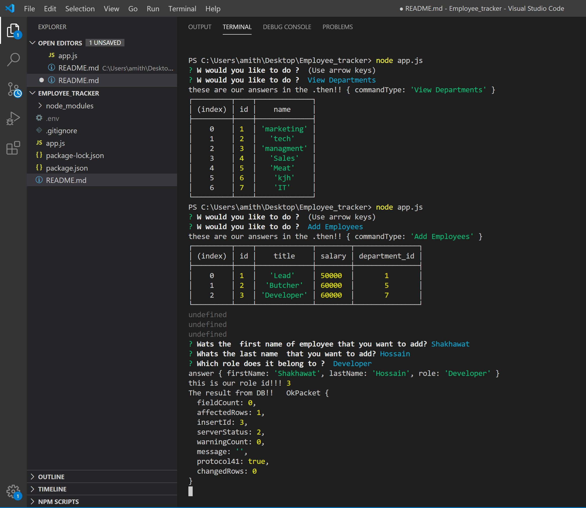

# MySQL Connectivity: Employee Tracker

I Created a terminal engine application that allows the user 

  * Add departments, roles, employees
  * View departments, roles, employees
  * Update employee roles
  * Update employee managers


## video presentation 
    https://drive.google.com/file/d/1OftRVYId7MvPkf7ZqZLf0Ha0raIowRuZ/view
    https://drive.google.com/file/d/1hgLzIH1U3-DMpoEwWsp5SbLaxhYuhRrd/view

## Acceptance Criteria

    ```
    As a business owner
    I want to be able to view and manage the departments, roles, and employees in my company
    So that I can organize and plan my business
    ```

## Build status
project still in development phase

    Build status of continus integratio
    tools: (to be used):
        1. jenkins
        2. heroku
    
[](https://travis-ci.org/akashnimare/foco)
[](https://ci.appveyor.com/project/akashnimare/foco/branch/master)

## Code style

[](https://github.com/feross/standard)


## Tech/framework used
    node.js

## Features

    1. user friendly
    2. simplified 
    3. Easy Navigation
    4. SEO (Search Engine Optimization)
    5. Mobile Friendly

## Code Example

    1. Used consistent indentation
    2. Followed the DRY Principle
    3. Avoided Deep Nesting
    4. kept Limited line length
    5. standard File and folder structure
    6. standard Naming conventions.
    7. Kept the code simple.

## Installation

    To run the template engine: node app.js

## Screenshot
Terminal Screenshot



## API Reference

    https://www.npmjs.com/package/inquirer
    https://www.npmjs.com/package/console.table 

## Tests
    N/A

## Contribute

Let people know how they can contribute into your project. A [contributing guideline](https://github.com/zulip/zulip-electron/blob/master/CONTRIBUTING.md) will be a big plus.

## Credits
upenn coding bootcamp


## License
A short snippet describing the license (MIT, Apache etc)

MIT © [Amith Das]()